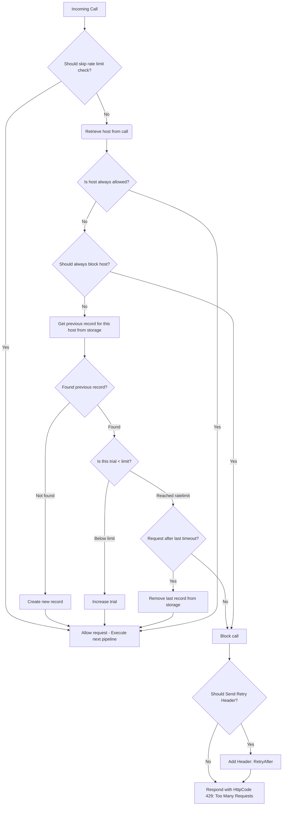

# Module RateLimit

Limit the requests sent to a Ktor server with a timeout.

- [Source code](https://github.com/hfhbd/RateLimit)
- [Docs](https://ratelimit.softwork.app)

## Install

This package is uploaded to MavenCentral and supports JVM and all native targets as well.

````kotlin
repositories {
    mavenCentral()
}

dependencies {
    implementation("app.softwork:ratelimit:LATEST")
}
````

## Usage

Simple install it in your application module or for a specific route.

```kotlin
val storage: Storage = // Storage implementation, required
install(RateLimit(storage = storage)) {
    limit = 1000
    timeout = 1.hours

    host = { call ->
        call.request.local.remoteHost
    }

    alwaysAllow { host ->
        host.startsWith("foo")
    }

    alwaysBlock { host ->
        host.endsWith("bar")
    }

    skip { call ->
        if (call.request.local.uri == "/login") { // alternative: install at this route only
            RateLimit.SkipResult.ExecuteRateLimit
        } else {
            RateLimit.SkipResult.SkipRateLimit
        }
    }
}
```

## Storage

To persist the rate limiting, you need to implement a `Storage` provider, which use `kotlinx.datetime.Instant`. All
functions are `suspend` to support async `IO` operations.

## License

Apache 2

# Package app.softwork.ratelimit

The package contains the feature `RateLimit` and the `Storage` implementation.

